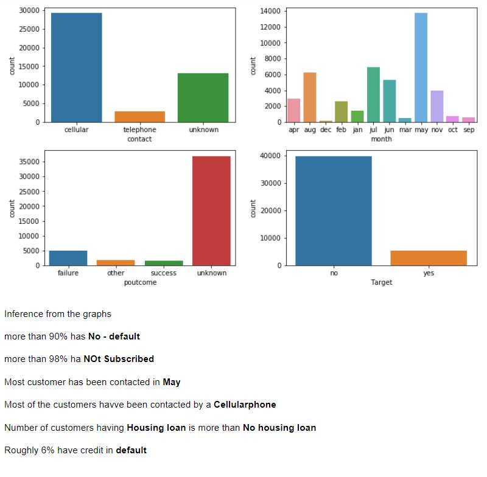

# Ensemble technique

__Data Description__:  

_The data is related with direct marketing campaigns of a
Portuguese banking institution. The marketing campaigns
were based on phone calls. Often, more than one contact to
the same client was required, in order to access if the product
(bank term deposit) would be ('yes') or not ('no') subscribed._

 __Domain : Banking__
 
 
__Context:__

Leveraging customer information is paramount for most
businesses. In the case of a bank, attributes of customers like
the ones mentioned below can be crucial in strategizing a
marketing campaign when launching a new product.

__Attribute Information:__
1. __age__ (numeric)

2. __job__ : type of job (categorical:
'admin.','blue-collar','entrepreneur','housemaid','manage
ment','retired','self-employed','services','student','technicia
n','unemployed','unknown')

3. __marital__ : marital status (categorical:
'divorced','married','single','unknown'; note: 'divorced'
means divorced or widowed)

4. __education__ (categorical:
'basic.4y','basic.6y','basic.9y','high.school','illiterate','profes
sional.course','university.degree','unknown')

5. __default: has credit in default?__ (categorical:
'no','yes','unknown')

6. __balance__: average yearly balance, in euros (numeric)

7. __housing__: has housing loan? (categorical:
'no','yes','unknown')

8. __loan__: has personal loan? (categorical: 'no','yes','unknown')

9. __contact__: contact communication type (categorical:
'cellular','telephone')

10. __day__: last contact day of the month (numeric 1 -31)

11. __month__: last contact month of year (categorical: 'jan', 'feb',
'mar', ..., 'nov', 'dec')

12. __duration__: last contact duration, in seconds (numeric).
Important note: this attribute highly affects the output
target (e.g., if duration=0 then y='no'). Yet, the duration is
not known before a call is performed. Also, after the end
of the call y is obviously known. Thus, this input should
only be included for benchmark purposes and should be
discarded if the intention is to have a realistic predictive
model.

13. __campaign__: number of contacts performed during this
campaign and for this client (numeric, includes last
contact)

14. __pdays__: number of days that passed by after the client
was last contacted from a previous campaign (numeric;
999 means client was not previously contacted)

15. __previous__: number of contacts performed before this
campaign and for this client (numeric)

16. __poutcome__: outcome of the previous marketing
campaign (categorical: 'failure','nonexistent','success')
17.target: has the client subscribed a term deposit? (binary:
"yes","no")

# Steps

__Exploratory data Analysis__

- Missing values handling

- 5 point summary, calulate IQR

- Detect outliers if any & solve them

- Data distribution identification: Normal/ skewness

- Get correlation values, perform data balancing

__Dta Pre-processing__

- Label encoding.

- change data types if needed

- handle outliers with mean replacements

- pairplot  to know the feature importance

-  Scale the data, standardize it if needed

__Split the data -Train, Test,__

__Model Building__: 

- Logistic regression, 

- Naive Bayes, 

- KNN, 

- SVM

__Ensembel Methods__

- Decision Tree

- Feture importance test for DT

- pruning of DT

- Bagging 

- Adaptive Boosting

- Gradient Boosting

- Random Forest

__Models With accuracy score__

__Conclusion__

- Comments on data set

- Comments on Models

- Miscellaneous comments

## Importing Necessary Libraries

## data set 

## Five Point Summary 

## Distribution of Numerical data

## Distribution of Categorical data

## Measure of Skewness in Data

## Checking for Outliers via Box Plot

## Encoding of Numerical Features

## handling Outliers- After Replacing with mean

## Correlation Heatmap- Before Outlier Removal

## Correlation Heatmap- After Outlier Removal

## Pairplot 

# Results
## Model Accuracy with Scores

